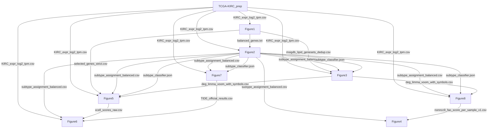

# KIRC Lipid-Metabolism Subtypes

A multi-cohort bioinformatics study identifying and validating two
lipid-metabolism subtypes (S1 and S2) of clear cell renal cell carcinoma
(ccRCC / TCGA-KIRC), with validation in E-MTAB-1980, ICGC RECA-EU, and
CPTAC cohorts.

## Repository structure

| Folder | Purpose | Entry point |
|---|---|---|
| `TCGA-KIRC_prep/` | Raw TCGA-KIRC cleaning + GDC raw counts | `tcga_kirc_prep.py`, `download_gdc_counts.py` |
| `Figure1_gene_selection/` | Gene selection (MSigDB + Cox + strict filter) | `scripts/run_upstream.py` |
| `Figure2_clustering/` | Consensus clustering + NCC classifier | `scripts/run_upstream.py` |
| `Figure3_transcriptomic_CPTAC/` | DEG / GSEA / GSVA / CPTAC | `scripts/run_all.py` |
| `Figure4_genomic/` | Mutation and CNA landscape | `scripts/run_all.py` |
| `Figure5_immune/` | CIBERSORT / xCell / ssGSEA / scRNA-seq | `scripts/run_all.py` |
| `Figure6_associations_lipid_immune/` | Lipid-immune correlation | `scripts/run_all.py` |
| `Figure7_therapeutic_analysis_pubsize/` | oncoPredict + TIDE | `scripts/run_all.py` |
| `Figure8_External_validation_OS_KM_score_combined/` | Multi-cohort external validation | `scripts/run_all.py` |

## Dependency graph



## Pipeline execution

Run the projects in the order below. After each project finishes, copy
its outputs to the downstream projects as indicated.

### 1. TCGA-KIRC_prep

Run in `TCGA-KIRC_prep/`:

```
python tcga_kirc_prep.py
python download_gdc_counts.py --subtype-csv ../Figure2_clustering/data/subtype_assignment_balanced.csv
```

Then copy:

- `data/tcga_kirc/KIRC_expr_log2_tpm.csv` → Figure1, Figure2, Figure3, Figure5, Figure6, Figure7, Figure8
- `data/tcga_kirc/KIRC_expr_tpm.csv` → Figure5, Figure8
- `data/tcga_kirc/KIRC_clinical_cleaned.csv` → Figure2, Figure3, Figure8
- `data/tcga_kirc/KIRC_counts_for_limma.csv` → Figure3 (`data/raw/`), Figure5 (`data/raw/`)
- `data/tcga_kirc/sample_info_for_limma.csv` → Figure3 (`data/raw/`), Figure5 (`data/raw/`)

Run `download_gdc_counts.py` only after Figure2 has produced
`subtype_assignment_balanced.csv`.

### 2. Figure1_gene_selection

Run in `Figure1_gene_selection/scripts/`:

```
python run_upstream.py
```

Then copy:

- `data/consensus_cluster/balanced_genes.txt` → Figure2 (`data/`), Figure8 (`data/classifier/`)
- `data/gene_selection/selected_genes_strict.csv` → Figure5 (`data/processed/`)
- `data/msigdb_lipid_genesets_dedup.csv` → Figure3 (`data/gene_sets/`)
- `data/msigdb_lipid_gene_pool_dedup.csv` → Figure2 (`data/`), Figure8 (`data/`)

### 3. Figure2_clustering

Run in `Figure2_clustering/scripts/`:

```
python run_upstream.py
```

Then copy:

- `data/subtype_assignment_balanced.csv` → Figure3, Figure4, Figure5 (each `data/processed/`); Figure6, Figure7 (each `data/`); Figure8 (`data/classifier/` and `data/`)
- `data/subtype_classifier.json` → Figure3 (`data/processed/`); Figure5 (`data/processed/`); Figure7 (`data/`); Figure8 (`data/classifier/` and `data/`)

### 4. Figure3_transcriptomic_CPTAC

Run in `Figure3_transcriptomic_CPTAC/scripts/`:

```
python run_all.py
```

Then copy:

- `data/processed/deg_limma_voom_with_symbols.csv` → Figure5 (`data/processed/`), Figure8 (`data/deg/` and `data/`)

### 5. Figure5_immune

Run in `Figure5_immune/scripts/`:

```
python run_all.py
```

Then copy:

- `data/xcell/xcell_scores_raw.csv` → Figure6 (`data/`)

### 6. Figure7_therapeutic_analysis_pubsize

Run in `Figure7_therapeutic_analysis_pubsize/scripts/`:

```
python run_all.py
```

Then copy:

- `data/processed/TIDE_official_results.csv` → Figure6 (`data/`)

### 7. Figure8_External_validation_OS_KM_score_combined

Run in `Figure8_External_validation_OS_KM_score_combined/scripts/`:

```
python run_all.py
```

The first step (`make_mapping_jsons.py`) generates two gene-to-Ensembl
mapping JSON files inside `data/`. It requires `balanced_genes.txt` from
Figure1.

Then copy:

- `results/tables/nonncc9_fao_score_per_sample_v1.csv` → Figure4 (`data/raw/`)

### 8. Figure6_associations_lipid_immune

Run in `Figure6_associations_lipid_immune/scripts/`:

```
python run_all.py
```

### 9. Figure4_genomic

Run in `Figure4_genomic/scripts/`:

```
python run_all.py
```

If a downstream script reports a missing file, check the "Inputs"
section of its README to see which upstream project produces it and
where it should be copied.

## Environment

Python 3.10+ and R 4.4+ are both required.

```
python -m pip install -r requirements.txt
Rscript install_packages.R
```

## Data

Large raw files (TCGA downloads, GDSC2 RDS, scRNA-seq h5, external
cohorts) are not included. Each project's README lists its required
inputs and their sources.

## Citation

See `CITATION.cff`.

## License

MIT. See `LICENSE`.
